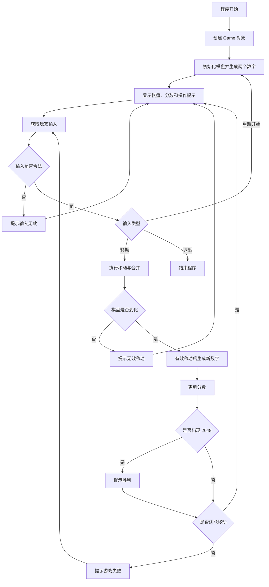
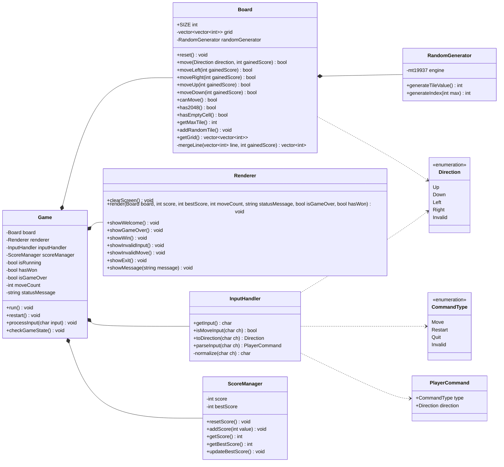
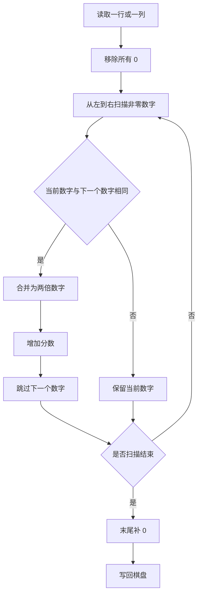

# 《基于 C++ 面向对象程序设计的 2048 控制台游戏设计与实现》

## 1 项目概述

### 1.1 项目背景

2048 是一个规则简单但逻辑清晰的数字合成类游戏。玩家通过上下左右移动棋盘中的数字，使相同数字合并并获得分数，最终目标是合成 2048。本项目选择 2048 作为 C++ 面向对象课程设计题目，是因为它既有明确的用户交互，又包含移动、合并、随机生成、胜负判断等典型算法，适合展示类设计、封装和对象协作。

### 1.2 项目目标

本项目目标是实现一个稳定可靠的 2048 控制台版游戏。程序应能够在 VSCode 中通过 g++ 编译运行，支持标准 2048 规则，能够格式化显示棋盘、当前分数、最高分和操作提示，并在胜利或失败时给出明确提示。

### 1.3 开发环境

| 项目 | 内容 |
|---|---|
| 操作系统 | Windows |
| 编辑器 | VSCode |
| 编译器 | g++ / MinGW-w64 |
| 语言标准 | C++17 |
| 项目类型 | C++ 面向对象控制台游戏 |

### 1.4 项目特点

1. 使用多文件工程组织代码，类职责清晰。
2. 使用 C++ 类封装棋盘、输入、显示、分数和随机数逻辑。
3. 使用统一的 `mergeLine()` 函数复用移动合并算法。
4. 有效移动后才生成新数字，符合 2048 规则。
5. C++ 控制台界面使用 ANSI 彩色方块、分数卡片、目标进度条和状态面板，提升运行界面的可读性和设计感。
6. Windows 终端下支持方向键和单键输入，交互体验比传统逐行输入更自然。
7. 提供单文件整合版，方便复制运行和课程演示。
8. 项目额外提供网页交互展示版，方便通过浏览器查看更直观的按钮交互效果。

### 1.5 GitHub 仓库地址

本项目已上传至 GitHub，公开仓库地址如下：

```text
https://github.com/bushiAgoni/Game2048
```

## 2 需求分析

### 2.1 功能需求

项目需要实现以下功能：

1. 初始化 4 x 4 棋盘，并随机生成两个数字。
2. 玩家通过 W/A/S/D 控制上下左右移动。
3. 相同数字沿移动方向合并，并更新分数。
4. 每次有效移动后生成一个随机新数字。
5. 支持 R 重新开始游戏。
6. 支持 Q 退出游戏。
7. 显示当前分数、最高分和操作提示。
8. 显示步数、最大数字和 2048 目标进度。
9. 出现 2048 时提示胜利。
10. 无法继续移动时提示游戏失败。
11. Windows 终端下支持方向键和单键输入。

### 2.2 非功能需求

1. 程序能够直接编译运行。
2. 不依赖第三方图形库，不使用 EasyX。
3. 代码结构清晰，便于阅读和维护。
4. 输入非法字符时程序不能崩溃。
5. 核心逻辑尽量避免平台强依赖。

### 2.3 用户操作需求

| 操作 | 说明 |
|---|---|
| `W/w` | 上移 |
| `A/a` | 左移 |
| `S/s` | 下移 |
| `D/d` | 右移 |
| `R/r` | 重新开始 |
| `Q/q` | 退出游戏 |

### 2.4 游戏规则分析

棋盘为 4 x 4。每次移动时，棋盘中所有数字会沿输入方向尽量靠拢；相邻且相等的数字会合并为一个更大的数字。一次移动中，每个格子最多合并一次，例如 `[2, 2, 2, 0]` 左移后应变为 `[4, 2, 0, 0]`，而不是 `[2, 4, 0, 0]` 或 `[6, 0, 0, 0]`。

## 3 总体设计

### 3.1 系统总体架构

系统采用面向对象分层设计。`Game` 类是核心控制器，负责连接输入、棋盘、显示和分数对象。`Board` 负责游戏核心数据和算法，`Renderer` 负责显示，`InputHandler` 负责输入转换，`ScoreManager` 负责分数，`RandomGenerator` 负责随机数。

### 3.2 模块划分

| 模块 | 主要类 | 职责 |
|---|---|---|
| 游戏控制模块 | `Game` | 主循环、状态控制、命令分发 |
| 棋盘模块 | `Board` | 棋盘存储、移动、合并、胜负辅助判断 |
| 显示模块 | `Renderer` | 打印彩色棋盘、分数卡片、进度条、状态栏和操作面板 |
| 输入模块 | `InputHandler` | 读取和解析用户输入，支持方向键和单键输入 |
| 分数模块 | `ScoreManager` | 当前分数和最高分 |
| 随机模块 | `RandomGenerator` | 随机位置和随机数字 |

### 3.3 文件结构设计

```text
Game2048/
|-- include/
|   |-- Board.h
|   |-- Game.h
|   |-- InputHandler.h
|   |-- RandomGenerator.h
|   |-- Renderer.h
|   `-- ScoreManager.h
|-- src/
|   |-- Board.cpp
|   |-- Game.cpp
|   |-- InputHandler.cpp
|   |-- RandomGenerator.cpp
|   |-- Renderer.cpp
|   |-- ScoreManager.cpp
|   `-- main.cpp
|-- docs/
|   |-- 项目设计文档.md
|   |-- 测试报告.md
|   `-- 答辩讲解提纲.md
|-- web/
|   |-- index.html
|   |-- styles.css
|   |-- app.js
|   |-- preview.png
|   `-- serve.cjs
|-- single_file/
|   `-- main.cpp
`-- README.md
```

### 3.4 程序运行流程

程序启动后创建 `Game` 对象，进入主循环。每轮循环先显示棋盘和提示信息，再读取玩家输入。若输入为移动命令，程序调用 `Board::move()` 执行移动和合并；若棋盘发生变化，则生成新数字并更新分数；随后判断是否胜利或失败。若输入为重新开始或退出，则执行对应控制逻辑。



## 4 类设计

### 4.1 Game 类设计

`Game` 类负责游戏主流程，是各对象之间的协调者。

主要成员变量：

| 成员 | 类型 | 含义 |
|---|---|---|
| `board` | `Board` | 棋盘对象 |
| `renderer` | `Renderer` | 显示对象 |
| `inputHandler` | `InputHandler` | 输入对象 |
| `scoreManager` | `ScoreManager` | 分数对象 |
| `isRunning` | `bool` | 程序是否运行 |
| `hasWon` | `bool` | 是否已经提示过胜利 |
| `isGameOver` | `bool` | 是否游戏失败 |
| `moveCount` | `int` | 记录本局有效移动步数 |
| `statusMessage` | `std::string` | 状态提示信息 |

主要函数：

| 函数 | 功能 |
|---|---|
| `run()` | 启动主循环 |
| `restart()` | 重新开始游戏 |
| `processInput(char input)` | 处理玩家输入 |
| `checkGameState()` | 判断胜利和失败 |

### 4.2 Board 类设计

`Board` 类封装 4 x 4 棋盘数据和移动合并算法。

主要成员变量：

| 成员 | 类型 | 含义 |
|---|---|---|
| `grid` | `std::vector<std::vector<int>>` | 棋盘数据 |
| `randomGenerator` | `RandomGenerator` | 随机生成器 |

主要函数：

| 函数 | 功能 |
|---|---|
| `reset()` | 清空棋盘并生成两个初始数字 |
| `move(Direction, int&)` | 按方向移动并返回是否有效 |
| `moveLeft()`、`moveRight()`、`moveUp()`、`moveDown()` | 四方向移动 |
| `canMove()` | 判断是否还可以移动 |
| `has2048()` | 判断是否出现 2048 |
| `getMaxTile()` | 获取当前棋盘最大数字，用于界面显示和目标进度 |
| `addRandomTile()` | 在空格中随机生成 2 或 4 |
| `mergeLine()` | 合并一行或一列，是核心复用算法 |

### 4.3 Renderer 类设计

`Renderer` 类只负责显示，不修改游戏数据。

主要函数：

| 函数 | 功能 |
|---|---|
| `render()` | 显示彩色棋盘、分数卡片、步数、最大数字、进度条、状态和操作提示 |
| `clearScreen()` | 使用 ANSI 转义序列清屏并回到左上角 |
| `showGameOver()` | 显示失败提示 |
| `showWin()` | 显示胜利提示 |
| `showMessage()` | 显示状态消息 |
| `tileStyle()` | 根据数字大小返回不同 ANSI 前景色和背景色 |
| `printProgress()` | 根据最大数字显示 2048 目标进度条 |

### 4.4 InputHandler 类设计

`InputHandler` 类负责读取用户输入并转换为命令。

主要函数：

| 函数 | 功能 |
|---|---|
| `getInput()` | 从控制台读取输入；Windows 终端下使用 `_getch()` 支持单键输入和方向键 |
| `isMoveInput()` | 判断是否为移动输入 |
| `toDirection()` | 将字符转换为方向 |
| `parseInput()` | 将字符转换为完整玩家命令 |

### 4.5 ScoreManager 类设计

`ScoreManager` 类负责当前分数和最高分。

主要函数：

| 函数 | 功能 |
|---|---|
| `resetScore()` | 重置当前分数 |
| `addScore()` | 增加分数 |
| `getScore()` | 获取当前分数 |
| `getBestScore()` | 获取最高分 |
| `updateBestScore()` | 更新最高分 |

### 4.6 RandomGenerator 类设计

`RandomGenerator` 类封装随机数逻辑。

主要函数：

| 函数 | 功能 |
|---|---|
| `generateTileValue()` | 90% 概率生成 2，10% 概率生成 4 |
| `generateIndex()` | 在指定范围内生成随机下标 |

### 4.7 类之间的关系

`Game` 组合 `Board`、`Renderer`、`InputHandler` 和 `ScoreManager`。`Board` 组合 `RandomGenerator`。`InputHandler` 和 `Board` 都会使用 `Direction` 枚举表示移动方向。



### 4.8 面向对象思想体现

1. 封装：棋盘数据 `grid` 为私有成员，只通过公开接口访问。
2. 抽象：输入、显示、分数和随机数各自抽象为独立类。
3. 组合：`Game` 通过组合多个对象完成完整游戏。
4. 单一职责：每个类只负责一类明确任务，降低耦合。
5. 代码复用：移动合并算法统一由 `mergeLine()` 实现。

## 5 核心算法设计

### 5.1 棋盘移动算法

棋盘移动分为左、右、上、下四个方向。左移直接按行处理；右移先反转每一行，复用左移合并逻辑后再反转回来；上移按列读取，复用合并逻辑；下移先反转列，再合并，最后反转写回。

### 5.2 数字合并算法

合并算法以一行或一列为输入，步骤如下：

1. 删除所有 0，得到非零数字序列。
2. 从左到右扫描序列。
3. 如果当前数字和下一个数字相同，则合并为两倍数字。
4. 合并数字加入新序列，分数增加合并后的值。
5. 合并后跳过下一个数字，保证每个数字一次移动最多合并一次。
6. 未合并数字按原顺序保留。
7. 最后补 0，使长度恢复为 4。



### 5.3 随机生成数字算法

每次有效移动后，程序调用 `getEmptyCells()` 找到所有空格，再调用 `RandomGenerator::generateIndex()` 随机选择一个空格。数字生成使用 1 到 10 的随机整数，其中 10 对应数字 4，其他值对应数字 2，因此数字 2 的概率约为 90%，数字 4 的概率约为 10%。

### 5.4 胜利判断算法

遍历棋盘所有格子，如果任意格子的值等于 2048，则说明玩家胜利。程序使用 `hasWon` 标记避免反复提示同一次胜利。

### 5.5 失败判断算法

失败条件为棋盘没有空格，并且所有横向、纵向相邻格子都不相等。只要存在空格或相邻可合并数字，游戏仍可继续。

### 5.6 输入合法性判断算法

输入处理类先将字符转换为小写，再判断是否属于 `w`、`a`、`s`、`d`、`r`、`q`。移动命令转换为 `Direction`，重新开始和退出转换为对应命令，其他字符转换为无效命令。

## 6 详细实现

### 6.1 主函数设计

多文件版入口位于 `src/main.cpp`。主函数在 Windows 下设置控制台 UTF-8 编码，然后创建 `Game` 对象并调用 `run()`。

### 6.2 游戏初始化

`Board` 构造时调用 `reset()`，先把 4 x 4 棋盘全部置为 0，然后连续调用两次 `addRandomTile()` 生成初始数字。

### 6.3 游戏主循环

`Game::run()` 中使用 `while (isRunning)` 控制主循环。每轮显示棋盘、读取输入、处理命令、更新状态，直到玩家输入 `Q`。

### 6.4 棋盘显示

`Renderer::render()` 使用 ANSI 转义序列实现彩色控制台显示。棋盘使用固定宽度单元格，不同数字对应不同背景色，空格显示为深色占位符。界面上方显示分数、最高分、步数和最大数字，下方显示 2048 目标进度条、状态提示和操作面板。该设计仍然是 C++ 控制台程序的一部分，不依赖网页或第三方图形库。

### 6.5 分数更新

每次合并得到的新数字会累加到 `gainedScore`。如果本次移动有效，`Game` 调用 `ScoreManager::addScore()` 更新当前分数和最高分，同时将 `moveCount` 加 1，用于界面显示本局步数。

### 6.6 重新开始与退出

输入 `R` 时调用 `restart()`，重置棋盘、当前分数、胜利状态和失败状态。输入 `Q` 时将 `isRunning` 设为 `false`，主循环结束。

## 7 测试报告

### 7.1 测试环境

| 项目 | 内容 |
|---|---|
| 操作系统 | Windows |
| 编译器 | g++ / MinGW-w64 |
| 编译标准 | C++17 |
| 编译命令 | `g++ -std=c++17 -Wall -Wextra -Iinclude src/*.cpp -o 2048.exe` |

### 7.2 测试方法

测试方法包括编译测试、运行测试、人工输入测试和构造棋盘状态的逻辑分析。由于随机生成数字存在不确定性，部分测试通过观察“空格数量减少”“新数字只出现在空格中”“无效移动不生成新数字”等现象进行验证。

### 7.3 测试用例

| 测试编号 | 测试内容 | 输入数据 / 操作 | 预期结果 | 实际结果 | 是否通过 |
|---|---|---|---|---|---|
| T01 | 程序启动测试 | 运行 `./2048.exe` | 程序正常启动并显示棋盘 | 正常启动 | 通过 |
| T02 | 初始棋盘生成测试 | 启动游戏 | 棋盘随机出现两个 2 或 4 | 出现两个初始数字 | 通过 |
| T03 | 向左移动测试 | 输入 `A` | 数字向左靠拢，有效移动后生成新数字 | 行为符合规则 | 通过 |
| T04 | 向右移动测试 | 输入 `D` | 数字向右靠拢，有效移动后生成新数字 | 行为符合规则 | 通过 |
| T05 | 向上移动测试 | 输入 `W` | 数字向上靠拢，有效移动后生成新数字 | 行为符合规则 | 通过 |
| T06 | 向下移动测试 | 输入 `S` | 数字向下靠拢，有效移动后生成新数字 | 行为符合规则 | 通过 |
| T07 | 数字合并测试 | 构造 `[2,2,2,0]` 左移 | 结果为 `[4,2,0,0]`，不会连续重复合并 | 合并逻辑符合规则 | 通过 |
| T08 | 分数更新测试 | 合并 `2 + 2` | 当前分数增加 4 | 分数增加正确 | 通过 |
| T09 | 非法输入测试 | 输入 `x` | 提示输入无效，程序不崩溃 | 能继续游戏 | 通过 |
| T10 | 胜利判断测试 | 棋盘出现 2048 | 显示胜利提示 | 能提示胜利 | 通过 |
| T11 | 失败判断测试 | 棋盘满且无相邻相等数字 | 显示游戏失败 | 能提示失败 | 通过 |
| T12 | 重新开始测试 | 输入 `R` | 当前分数清零，重新生成两个数字 | 能重新开始 | 通过 |
| T13 | 退出游戏测试 | 输入 `Q` | 程序退出 | 能正常退出 | 通过 |

### 7.4 测试结果

多文件版和单文件版均能通过 g++ 编译。基本游戏流程、四方向移动、合并得分、随机生成、重新开始、退出、胜利和失败判断均符合项目要求。

### 7.5 问题分析与解决

1. 随机数字导致棋盘每次不同，因此测试时不能依赖固定初始棋盘。
2. Windows 控制台可能存在中文编码问题，程序在 Windows 下设置 UTF-8 编码以改善显示。
3. 无效移动必须特殊处理，否则可能错误生成新数字。当前实现只有 `Board::move()` 返回 `true` 时才生成新数字。

## 8 项目总结

### 8.1 项目完成情况

项目已完成 2048 控制台版的核心功能，包含多文件版、单文件版、README、设计文档、流程图、UML 类图、测试报告和答辩提纲。

### 8.2 项目亮点

1. 类职责清晰，符合面向对象课程设计要求。
2. 合并算法通过 `mergeLine()` 复用，减少重复代码。
3. 对无效输入和无效移动进行了稳定处理。
4. C++ 控制台版本实现了彩色界面、分数卡片、进度条和状态面板。
5. Windows 终端下支持方向键和单键输入，提升了交互体验。

### 8.3 不足之处

1. 当前版本仍属于控制台界面，无法像完整 GUI 那样支持真实鼠标点击控件。
2. 最高分只在程序运行期间保存，没有写入本地文件。
3. 暂未提供撤销一步功能。

### 8.4 后续改进方向

1. 扩展 EasyX 图形界面，使棋盘显示更直观。
2. 增加最高分文件保存功能。
3. 增加撤销功能和游戏历史记录。
4. 增加自动化测试入口，进一步验证核心算法。
5. 支持不同棋盘大小和难度设置。

## 9 附加网页交互版说明

### 9.1 设计目的

本项目主体仍然是 C++17 面向对象控制台游戏。为了更直观地展示 2048 游戏界面和按钮操作效果，项目额外提供了一个网页交互版。网页交互版不替代 C++ 源代码实现，而是作为展示扩展，便于在浏览器中观察彩色棋盘、方向按钮、分数面板和状态提示。

### 9.2 文件组成

| 文件 | 作用 |
|---|---|
| `web/index.html` | 网页交互版的页面结构，包含棋盘、分数区、状态区和方向按钮。 |
| `web/styles.css` | 网页交互版的样式文件，负责颜色、布局、按钮和响应式显示。 |
| `web/app.js` | 网页交互版的游戏逻辑，实现移动、合并、分数、胜负判断和按钮事件。 |
| `web/preview.png` | 网页交互版预览图，便于在文档和仓库中查看界面效果。 |
| `web/serve.cjs` | 可选本地静态预览服务脚本，用于浏览器限制直接打开本地文件时使用。 |

### 9.3 运行方式

最简单的方式是直接打开：

```text
web/index.html
```

如果浏览器限制直接打开本地文件，可以在项目根目录执行：

```bash
node web/serve.cjs
```

然后访问：

```text
http://127.0.0.1:5500/
```

也可以使用 Python 启动本地服务：

```bash
cd web
py -m http.server 5500 --bind 127.0.0.1
```

### 9.4 功能说明

网页交互版实现了与 C++ 版本一致的 2048 基本规则：4 x 4 棋盘、随机生成 2 或 4、四方向移动、相同数字合并、有效移动后生成新数字、分数统计、胜利判断和失败判断。网页版本提供鼠标点击方向按钮，也支持键盘方向键和 W/A/S/D 辅助操作。
